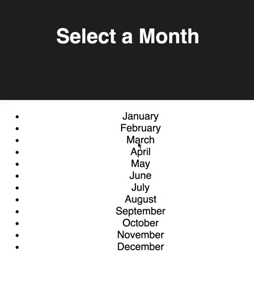
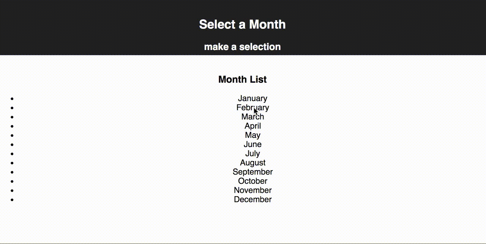

# React Month Picker

Before you get started make sure to look through the code that has been provided. Server side code to retrieve data (`GET`) has been provided for you. For this code challenge, you should only modify or add files in the `src` folder.

### Setup

Start the server.

```
npm install
npm run server
```

Now that the server is running, open a new terminal tab with `cmd + t` and start the react client app.

```
npm run client
```

## BASE MODE

This app will display a list of months on the page. When one is clicked, it will also display in the page header.

### Details

- Use `axios` to retrieve (`GET`) data from `/calendar` and store it in `App.js`. `/calendar` returns an array of calendar month names and ids.
- Create a new component called `MonthItem`. `MonthItem` should be the Month to display.
- Create a new component for the list of months called `MonthList`. `MonthList` should be handling the making of each `MonthItem` (creating a `MonthItem` for each month).
- When a month is clicked, it should alert the month name to the user.


### Base Mode Mockup



---

## STRETCH FEATURE

- Move the header into it's own component, `Header`, as a child of App. `Header` should display the month that was just clicked. Keep the data in App.js. You will have to get the data from the `MonthItem` "up" to `App` and then into `Header`.

### Stretch Mode Mockup


